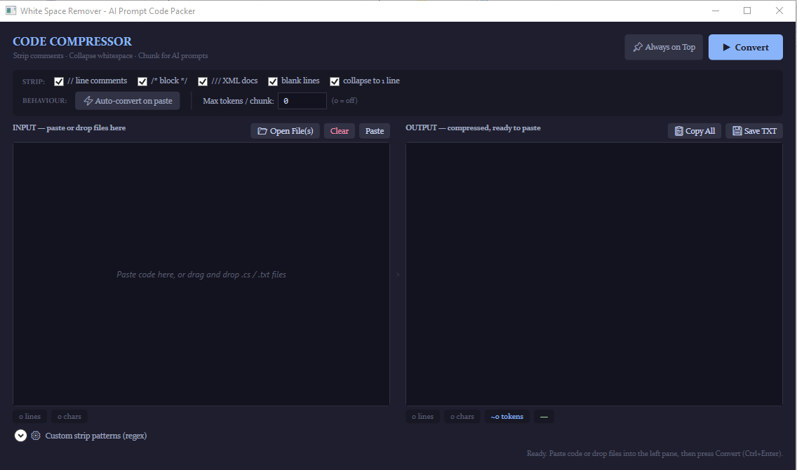

# RemoveWhiteSpaces — AI Prompt Packer

A lightweight WPF desktop utility for Windows that strips comments, collapses whitespace, and compresses source code into a single dense line — ready to paste into AI prompts (Claude, ChatGPT, Copilot, etc.) without wasting context-window tokens.

---

## What it does

When you paste code into an AI prompt you typically don't need comments, blank lines, or indentation — they consume tokens without adding information. Code Compressor automates the cleanup.

**Input:**
```csharp
public static class GreaseCalcs
{
    // Returns average grease pressure for the given slipway declivity.
    public static double ComputeGreasePressure(double declivity)
    {
        return Interpolations.InterpolLinear(declivity,
            GreaseModel.Table6Declivity,
            GreaseModel.Table6Pressure);
    }
}
```

**Output:**
```
public static class GreaseCalcs { public static double ComputeGreasePressure(double declivity) { return Interpolations.InterpolLinear(declivity, GreaseModel.Table6Declivity, GreaseModel.Table6Pressure); } }
```

---

## Features

| Feature | Details |
|---|---|
| **Comment stripping** | Removes `//` line comments, `/* */` block comments, and `///` XML doc comments independently. String-literal-aware state machine — never strips `//` or `/*` inside a string. |
| **Whitespace collapse** | Trims every line, drops blank lines, and joins everything into a single space-separated line. |
| **Token estimator** | Displays an approximate token count (`chars ÷ 4`) in the output stats bar so you know at a glance whether you fit inside a model's context window. |
| **Chunk splitter** | Set a *Max tokens / chunk* limit. The output is split into numbered parts with a `◀ Part X of Y ▶` navigator. Splits on word boundaries to avoid cutting identifiers. Copy individual chunks or all at once. |
| **Multi-file input** | Open multiple source files via the file dialog or drag-and-drop several files at once onto the input pane. Files are concatenated with `// ═══ filename ═══` separators. |
| **Auto-convert on paste** | Optional toggle that runs the conversion automatically the moment you paste into the input pane. |
| **Custom regex patterns** | Add your own regular expressions to strip additional content — e.g. `[Obsolete]` attributes or `#region` / `#endregion` markers. Invalid patterns are rejected before they are saved. |
| **Always on Top** | Pin the window above your IDE or browser while you work. |
| **Settings persistence** | Window geometry, all toggle states, the chunk limit, and custom patterns are saved to `%AppData%\CodeCompressor\settings.json` and restored on next launch. |

---

## Screenshots



---

## Requirements

- Windows 10 or 11
- [.NET 6, 8, or 9 Runtime](https://dotnet.microsoft.com/download) (Desktop Runtime)
- Visual Studio 2022 or later (to build from source)

---

## Building from source

```bash
# Clone the repository
git clone https://github.com/GonavalAES/RemoveWhiteSpaces.git
cd CodeCompressor

# Build and run
dotnet run
```

Or open the `.sln` file in Visual Studio and press **F5**.

No external NuGet packages are required. The only dependencies are standard WPF and `System.Text.Json`, both included in the .NET SDK.

---

## Usage

1. **Paste** code into the left pane, or click **Open File(s)** / drag files onto it.
2. Select which elements to strip in the options bar.
3. Press **Convert** (or `Ctrl+Enter`).
4. Use **Copy All** to grab the result, or **Save TXT** to write a UTF-8 file.
5. If the output is too long for one prompt, set a token limit in *Max tokens / chunk* and navigate the chunks with the `◀ ▶` controls.

### Options bar reference

| Control | Default | Description |
|---|---|---|
| `// line comments` | ✔ on | Strip single-line comments |
| `/* block */` | ✔ on | Strip multi-line block comments |
| `/// XML docs` | ✔ on | Strip XML documentation comments |
| `blank lines` | ✔ on | Remove empty lines |
| `collapse to 1 line` | ✔ on | Join all lines into one |
| `⚡ Auto-convert on paste` | off | Convert immediately on paste |
| `Max tokens / chunk` | 0 (off) | Split output into chunks of this many tokens |

### Custom strip patterns

Expand the **⚙ Custom strip patterns** panel at the bottom of the window to add regular expressions applied after the built-in stripping passes. Examples:

```
\[Obsolete[^\]]*\]        →  removes [Obsolete] and [Obsolete("reason")] attributes
#region.*|#endregion      →  removes #region / #endregion markers
using\s+\w[\w.]*;         →  removes using directives
```

---

## Architecture

The project follows a simple two-class structure:

```
CodeCompressor/
├── MainWindow.xaml          # UI layout (WPF / XAML)
├── MainWindow.xaml.cs       # Event handling, compression pipeline, chunk splitter
└── AppSettings.cs           # Settings model — load/save via System.Text.Json
```

The comment-stripping engine uses a **character-level state machine** rather than a plain regex. It tracks whether the current position is inside a regular string `"…"`, a verbatim string `@"…"`, or a character literal `'.'`, so comments embedded in string literals are never accidentally removed.

---

## Token estimation

The token count displayed in the output stats bar is a rough approximation based on the rule of thumb that **1 token ≈ 4 characters** for English text and typical code. It is accurate enough for planning context usage but is not derived from any specific model's tokeniser.

Common context limits for reference:

| Model | Approximate context |
|---|---|
| Claude Sonnet / Opus | 200 000 tokens |
| GPT-4o | 128 000 tokens |
| GPT-4o mini | 128 000 tokens |
| Gemini 1.5 Pro | 1 000 000 tokens |

---

## License

MIT — see [LICENSE](LICENSE) for details.

---

## Acknowledgements

Built with WPF on .NET. Colour scheme inspired by [Catppuccin Mocha](https://github.com/catppuccin/catppuccin).
